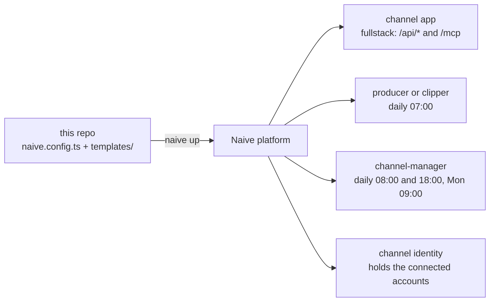

# 🎬 Media Blueprint

**An autonomous short-form video channel in one repository — clone it, run `naive up`, and the
Naive platform provisions the dashboard, the crew and the crons into your own organization.**

[](LICENSE)
[](https://www.npmjs.com/package/@usenaive-sdk/blueprints)
[](https://www.npmjs.com/package/@usenaive-sdk/vetta-cli)
[](https://nodejs.org)
[](https://react.dev)

It ships a management dashboard and a small agent team that plans, makes and queues vertical
video, and publishes only what you have approved.

The blueprint is the machine — the dashboard, `/api/*`, `/mcp`, the store, the approval flow
— and it carries **two templates**, which are data:

| Template | The channel it runs | Its crew | What it files |
|---|---|---|---|
| `faceless` | Generates original short-form video in one niche | `producer`, `channel-manager` | produced, multi-part |
| `clipping` | Repurposes existing video in one niche | `clipper`, `channel-manager` | clips |

One repo carries both, so switching is an edit and a `naive up` — never a re-clone and never a
new app. See [Switching template](#-switching-template).

The engine is [`@usenaive-sdk/blueprints`](https://www.npmjs.com/package/@usenaive-sdk/blueprints),
installed from the public npm registry like any other dependency. Nothing here resolves out of
a private workspace: a clone plus `pnpm install` is the whole toolchain.

## 🗺 What `naive up` provisions



- **The dashboard app** (`channel`, fullstack) — this repo's built UI, hosted under your org,
  backed by a thin server that talks to the platform on your behalf.
- **The template's agents**, each with a system prompt, a scoped tool policy, a daily budget
  and its own crons:
  - `channel-manager` — plans the calendar, drafts captions, manages the post queue, replies
    to comments. Never publishes an unapproved post. Both templates declare it.
  - `producer` (`faceless`) — creates original short videos from briefs using the channel's
    style templates (`generate_video`, `generate_image`).
  - `clipper` (`clipping`) — cuts the most engaging vertical clips out of the source channel
    you named and files them as pending posts (`clip_video`).
- **Nine starter style templates** (reference image + prompt) covering the current
  high-performing short-form aesthetics — the blueprint's shipped catalogue, present from the
  first turn.
- **The channel's crons** — the four fires below, so the channel works whether or not anyone
  opens the dashboard.
- **The channel identity** (`channel`) — the persona every agent and every schedule acts as,
  and the reason a connected account is reachable from a turn at all.

A freshly provisioned channel has **no posts and no channel profile**, and every screen shows
its empty state until you or an agent files something. That is the truth about a new
deployment: the dashboard never ships rows that pretend to be work someone did.

## 🚀 Get started

You need Node 22 or newer (Vite's floor is `^20.19 || >=22.12`, and `pnpm serve` runs the
server through Node's own TypeScript stripping), [pnpm](https://pnpm.io), and a platform API
key.

```sh
npm install -g @usenaive-sdk/vetta-cli          # installs the `naive` command
git clone https://github.com/usenaive/media-blueprint.git my-channel
cd my-channel
pnpm install

export NAIVE_API_KEY=sk_...                     # your platform API key
naive claim                                     # bind this clone to your organization
pnpm build                                      # UI + dist/api/app.js + dist/vercel.json
naive up                                        # provision everything in naive.config.ts
```

`naive up` reads [`naive.config.ts`](naive.config.ts) and reconciles your organization against
it, reporting each resource as `created | updated | unchanged | deleted | refused`. It is
idempotent — every resource is keyed by its name, so re-running it is always safe — and it
ships the dashboard only when `dist/` actually changed, which is why `pnpm build` comes first.

`NAIVE_API_KEY` is declared on the app as `{ from_env }`, so it is read from your shell at
apply time and never written into this repository. An unset variable refuses the apply by name,
naming the variable and never a value.

| Script | What it does |
|---|---|
| `pnpm install` | installs the toolchain, including the blueprint engine and the `naive` CLI |
| `pnpm build` | builds the UI to `dist/`, then `dist/api/app.js` and `dist/vercel.json` |
| `pnpm test` | the whole vitest suite — routes, MCP, templates, screens, config |
| `pnpm typecheck` | `tsc --noEmit` |
| `pnpm dev` | the hot-reloading UI, proxying `/api` and `/mcp` to `:8788` |
| `pnpm serve` | the dashboard server on `:8788`, over a JSON file store |

### 🔐 Getting into the deployed dashboard

Every `/api/*` route on the deployment — the post queue, "Post now", the agent roster, opening
a session, and deciding a held tool call — is behind the app's `DASHBOARD_TOKEN`. You never
have to invent that value and you never see it: `naive.config.ts` declares it
`{ generate: true }`, the platform makes one on the apply that creates the app, and no route
anywhere returns an app secret.

You get in by opening the dashboard from the studio that installed it. That mints a short-lived
entry ticket, the browser posts it to `POST /api/enter`, and the server trades it for an
`HttpOnly`, `SameSite=Lax` session cookie the browser then attaches to every same-origin call
by itself — the credential never passes through the DOM, a URL or storage. A deployment that
somehow has no token answers `503 not configured` to every API route rather than serving your
channel to anyone who finds the URL.

`/mcp` is untouched by all of this: the organization's agents authenticate there with their own
credentials.

## ⏰ The cadence

Both templates provision the same four fires, all of them in the channel's own timezone
(`CHANNEL_TIMEZONE` in [`templates/template.ts`](templates/template.ts) — one line, one edit)
and all of them running as the `channel` identity, so a scheduled run reaches the same
connected accounts a chat turn does.

| When | Who | What it does |
|---|---|---|
| Daily 07:00 | `producer` / `clipper` | Makes the next piece — one produced video, or the next batch of clips — and files it as a pending post |
| Daily 08:00 | `channel-manager` | Sweeps the queue: captions, kinds and scheduled days, so you open the dashboard to rows that are ready to approve |
| Daily 18:00 | `channel-manager` | Reads the comments and drafts replies in the channel's voice |
| Monday 09:00 | `channel-manager` | Plans the week and files the briefs the specialist produces against |

Nothing a cron does escapes the queue: the fires file and tidy pending posts, and every publish
and every reply still stops at your approval, exactly as it does when you brief an agent in
Chat.

## 🎨 The style library

Nine starter style templates ship with the blueprint — a name, a prompt with `[bracketed]`
per-brief slots, a trend note, and the reference image `generate_video` and `generate_image`
condition on. `channel.list_style_templates` is how the producer reads them, and Channel
settings is where you see them. They live in
[`seed/style-templates.ts`](seed/style-templates.ts) with their images in
[`src/assets/styles/`](src/assets/styles).

| Marble & ink | Ghibli dusk | Claymation |
|---|---|---|
|  |  |  |
| stoic / motivation staple | top saves on Reels | nostalgia, high shares |

The other six: Photoreal cinematic, Lo-fi loop, Ambient ASMR, Pixar-style 3D, Paper cutout and
Brainrot absurdist.

## 📮 Where a post can go

A post names one of the networks the platform can publish to — **bluesky, facebook, linkedin,
mastodon, threads, x** — and nothing else is offered anywhere in the dashboard or in
`create_post`. Vertical-video-only networks are absent because a post to one is refused
upstream, and a "Post now" button that returns an error is worse than a button that is not
there. The list lives in one place, [`seed/posts.ts`](seed/posts.ts); when the platform accepts
more, it grows there.

## 🖥 Operating the channel

| Screen | What it does |
|---|---|
| Onboarding | Answer what the running template asks — a niche, plus the source channel on `clipping` — in a short conversation; the answers persist |
| Chat | Talk to the channel manager — brief it, ask for clips or productions, adjust the plan |
| Posts | The post queue: Pending → Ready → Approved → Posted / Rejected, each row playing the video the agent filed; "Post now" publishes the caption and that video immediately, and only from **Approved** |
| Approvals | Every agent that has stopped to ask you something: the held call, the arguments it proposes (media played), and Approve / Reject with an optional reason |
| Analytics | Views and likes, summed from the posts this channel actually published |
| Accounts | Connect and reconnect social accounts through the hosted portal |
| Channel settings | Which template is running, the live agent roster and briefs, and the style template library |

Nothing goes out without your approval. Agents file posts as *pending* and cannot move them:
the dashboard's MCP server has no approve, reject or publish tool. The platform's own
`social.post` tool *is* granted to every agent — publishing an approved post is their job — but
at permission `ask`, so an agent never runs it unattended: the call pauses the session
(`stop_reason: awaiting_approval`, the session itself `idle`) and waits, listed in the
session's pending actions, until you approve or reject it.

**The Approvals screen is where you answer that.** It lists every session of this channel
holding a pending call, names the agent and the tool, renders the arguments the agent proposes
— playing any video or image among them, because a publish you cannot watch is not one you can
honestly approve — and sends your decision, with an optional reason, to the platform. The same
decision is still available from the CLI, which is where it used to be the *only* place:

```sh
naive session get <session-id>                                # pending_actions lists the held call
naive session confirm <session-id> --tool-call <id> --allow   # or --deny --reason "..."
```

So a post reaches an account by exactly two routes: you publish it yourself from the Posts
screen, or you approve an agent's held `social.post` call.

## 🛠 Building on top of it

This is why the repository is open. The machine is the code in `src/` and `server/`; everything
a channel actually *is* — its crew, their briefs, what they may call, what they file, when they
fire and what the screens call things — is data in [`templates/`](templates), and changing it is
an edit plus a re-apply.

| To change… | Edit | Then |
|---|---|---|
| which template runs | `ACTIVE` in [`templates/index.ts`](templates/index.ts) | `pnpm build && naive up` |
| an agent's brief or its platform tools | the `agent({ … })` call in [`templates/faceless.ts`](templates/faceless.ts) or [`templates/clipping.ts`](templates/clipping.ts) | `naive up` |
| add an agent to the crew | the `agents` array of that template, built with the shared `agent()` helper | `naive up` |
| the model, budget or approval gate every agent shares | [`templates/template.ts`](templates/template.ts) | `naive up` |
| when a cron fires, or what it is told to do | `CHANNEL_MANAGER_SCHEDULES` and the specialist's `schedule({ … })` | `naive up` |
| the timezone all of them fire in | `CHANNEL_TIMEZONE` — one line | `naive up` |
| the post kinds, the onboarding questions, the words the queue prints | `kinds`, `questions` and `words` on the template | `pnpm build && naive up` |
| the style library | [`seed/style-templates.ts`](seed/style-templates.ts) | `pnpm build && naive up` |
| the dashboard's screens | [`src/screens/`](src/screens) | `pnpm build && naive up` |
| a new MCP tool for agents to call | [`server/mcp.ts`](server/mcp.ts) and [`server/routes.ts`](server/routes.ts) | `pnpm build && naive up` |

Three rules worth knowing before your first edit:

- **An agent needs a persona.** The `agent()` helper names `CHANNEL_IDENTITY` for you, and
  `schedule()` does the same for every fire. Without it a turn's connection tools resolve to
  nothing, silently, and a cron runs as nobody.
- **The toolset denies by name and asks by default.** Every built-in an agent was not granted
  is written `deny` — the sandbox tools included — and the *default* is `ask`, which is what
  reaches the connection tools no config can enumerate ahead of time. A connection tool is
  therefore always offered and never runs unattended.
- **Never grant `social.post` at `allow`.** That is a publish path straight around the queue
  the dashboard and the system prompts promise. `naive.config.test.ts` and
  `templates/templates.test.ts` exist to stop it happening by accident.

Adding a template is the same shape: a module beside `faceless.ts` and `clipping.ts` exporting
a `MediaTemplate`, its name in the `TemplateName` union, its demo rows in `seed/posts.ts`, and
its entry in `TEMPLATES`. The template tests will tell you what you missed.

## 🔌 Agents and the dashboard

The dashboard is also an MCP server (`POST /mcp`, [`server/mcp.ts`](server/mcp.ts)), and
`naive.config.ts` declares it (`mcp: "/mcp"` on the `channel` app). On every turn, each agent in
the project is offered the dashboard's tools as `channel.<tool>` — no per-agent wiring: the
platform mints the bearer token, injects it into the app as the `VETTA_MCP_TOKEN` secret, and
sends it with every call. Without that token the endpoint answers `401`.

| Tool | What it does |
|---|---|
| `list_posts {status?}`, `get_post {id}` | Inspect the queue |
| `create_post {caption, media_url?, platform?, agent?, account?, source?, status?}` | File a finished piece as *pending* (or *ready*), signed: who filed it, which account it is for, what it was made from |
| `update_post {id, caption?, media_url?}` | Fix a pending or ready post; approved and posted ones are yours |
| `list_style_templates`, `list_accounts`, `get_onboarding` | The style library, the connected accounts, the channel profile |

This server publishes nothing: there is no approve, reject or post tool in it, and every tool
description says so. Each `channel.*` tool is allowed by name.

**Connected accounts.** Every agent acts as the `channel` persona, which is what makes the
accounts you connect reachable from a turn: the platform resolves a session's connection tools
along `session → agent → identity → connected accounts`. Those tools register as
`<connector>.<operation>`, and which operations exist depends on the account you connected, so
no config here can name them — which is why the toolsets grant every tool they *can* name
(`allow`, or `deny` for a built-in this crew has no use for, sandbox included) and leave the
default at `ask`. A connection tool is therefore always offered and never runs unattended: it
stops on the Approvals screen with its arguments in front of you, exactly like `social.post`.

The one tool that can reach an account is the platform's own `social.post`, which is not part of
this server. The shared toolset in [`templates/template.ts`](templates/template.ts) grants it to
every agent at permission `ask`, so a call to it never runs unattended — it holds the session at
`awaiting_approval` for your decision (above). The permission is decided there, by the
blueprint, and not by whichever template happens to list the tool.

## 🔁 Switching template

A template is data ([`templates/`](templates)): the crew and its prompts, the tool allow-lists,
the post kinds it files, the questions onboarding asks and the words the queue prints. Nothing
about the machine changes with it — same screens, same routes, same `/mcp`, same app.

```ts
// templates/index.ts
export const ACTIVE: MediaTemplate = TEMPLATES.clipping;   // was TEMPLATES.faceless
```

Then `pnpm build && naive up`. The switch **widens and never narrows**:

- agents the new template declares are **created**;
- an agent only the old template declared is **reported and left running** — `naive.config.ts`
  hands `naive up` both templates, so the other crew is kept, and nothing is deleted by dropping
  a declaration. Retire one deliberately by adding its name to `removed`;
- your own rows are untouched: the posts, the accounts, the channel profile, the app, its URL,
  its database and its MCP token.

The dashboard's Channel settings screen names the template that is running.

**Editing a cron has one sharp edge.** Schedules are the only place in `naive up` where dropping
a declaration deletes: an agent's `schedules` are owned as a complete set and matched to live
rows **by exact cron string**, so `"0 8 * * 1"` and `"0 08 * * 1"` are a delete plus a create
rather than a patch. Change a fire's time deliberately; never re-spell one that is not changing.
(An agent with no `schedules` key at all owns nothing and deletes nothing — it is a *partial*
set that is destructive.)

## 💻 Running it locally

- **Demo mode** — `pnpm serve` in one shell and `pnpm dev` in another. The dev server proxies
  `/api` and `/mcp` to `:8788`, so the screens read the seeded **file** store over the real
  routes — seeded with the running template's own demo queue. No sample row is compiled into the
  bundle; `src/no-seed.test.ts` enforces that, which is why the demo rows live in
  [`seed/posts.ts`](seed/posts.ts) and not in `templates/` (the screens import a template).
- **Configured mode** — `pnpm build`, set `NAIVE_API_KEY` (and optionally `NAIVE_API_URL`,
  `NAIVE_IDENTITY_ID` for the channel persona's social routes), then `pnpm serve`. The server
  serves the built UI and fronts the platform behind `/api/*`; the key lives only in that server
  process and never reaches the browser. A screen whose backing route or key is absent says so —
  503 `not configured — set NAIVE_API_KEY` reaches the header slot rather than being swallowed.
  Set `VETTA_MCP_TOKEN` to open `/mcp` locally (the platform sets it in the deployed app);
  without it every MCP request is refused. `/api/*` skips the `DASHBOARD_TOKEN` gate **only** for
  a request that arrives on the loopback interface — your own browser against `pnpm serve`.
  Anything reaching this server over a real network (bound to `0.0.0.0`, a tunnel, a LAN peer) is
  gated exactly as the deployment is.

One route table serves both: [`server/routes.ts`](server/routes.ts) holds every path, `/mcp`
included, and `server/index.ts` (node `http`) and `server/api-entry.ts` (the deployed function)
are thin adapters over it. Locally the store is a JSON file under `data/`, seeded on first run
from `seed/`; on the deployment it is one document in the app database the platform provisions,
created **empty**. The browser and the agents therefore read and write the same rows: a post
filed over MCP is on the Posts screen after a reload.

`pnpm build` emits `dist/api/app.js` — one function for the whole surface — plus
`dist/vercel.json`, whose rewrites send `/mcp` and `/api/*` to it and fall back to `index.html`
for every screen URL.

## 📦 The `naive.config.ts` shape

```ts
import { defineProject } from "@usenaive-sdk/blueprints";
import { CLIPPING_SEEDS, FACELESS_SEEDS } from "./seed/posts.ts";
import { ACTIVE, CHANNEL_IDENTITY, TEMPLATES } from "./templates/index.ts";

export default defineProject({
  name: "media",
  blueprint: "media",
  template: ACTIVE.name,                 // chosen in templates/index.ts
  templates: [                           // every template this repo carries
    { ...TEMPLATES.faceless, seed: { posts: FACELESS_SEEDS } },
    { ...TEMPLATES.clipping, seed: { posts: CLIPPING_SEEDS } },
  ],
  identities: [{ name: CHANNEL_IDENTITY, description: "The channel itself — …" }],
  apps: [
    {
      name: "channel",
      type: "fullstack",
      deploy_dir: "dist",
      mcp: "/mcp",
      env: {
        NAIVE_API_KEY: { from_env: "NAIVE_API_KEY" },
        DASHBOARD_TOKEN: { generate: true },
      },
    },
  ],
});
```

The app is named `channel`, not `dashboard`: app names are unique per organization, so two
blueprints sharing a generic name would mean the second `naive up` adopts and overwrites the
first's app — its deployment, its database and its MCP token — and reports it as a routine
update.

The deployment is declared, not clicked together. To change agents, budgets, tool policies, or
the app itself, edit the config (and/or the UI code), rebuild, and run `naive up` again. To
delete a resource, move its name into the config's `removed` block (e.g.
`removed: { agents: ["producer"] }`); nothing is deleted just by dropping a declaration — which
is exactly what makes switching template safe.

The config can declare more than this template uses:

| Key | What it provisions |
|---|---|
| `apps[]` | `name`, `type`, `description`, `deploy_dir`, `mcp` (the path of the app's own MCP endpoint; fullstack only), and `env` — literals, `{ from_env }` or `{ generate: true }`, written as the app's secrets |
| `agents[]` | `model`, `budget`, `system`, `tools`, `skills`, `mcp_servers`, `allowed_apps`, `identity`, `schedules` |
| `agents[].schedules[]` | cron deployments, owned as a complete set per agent and matched by `cron` |
| `skills[]` | markdown files pushed by slug, versioned by content |
| `identities[]` | personas agents and schedules act as |
| `vaults[]` | credential vaults; values are `{ from_env }` only and reconciled by presence |
| `removed` | `apps`, `agents`, `skills`, `identities`, `vaults` to delete by name |

See the `naive` CLI reference in the platform docs for the reconciliation rules behind each key.

## 🤝 Contributing

Issues and pull requests are welcome — this repository is meant to be forked, cut about and
argued with.

- Fork, branch, and keep the change to one thing.
- `pnpm install && pnpm typecheck && pnpm test && pnpm build` must be green before you open a
  PR. The suite is fast and it is the review's floor, not its ceiling.
- Prefer adding a **template** over widening the machine: if your change is a channel's opinion
  rather than a channel's plumbing, it belongs in `templates/`.
- Nothing may weaken the approval gate. `naive.config.test.ts`, `templates/templates.test.ts`
  and `src/no-seed.test.ts` exist to catch exactly that — a publish path around the queue, or a
  demo row shipped as somebody's real data.
- Write the *why* in the commit message. The prose in this repository is part of the product.

## 📄 License

[MIT](LICENSE) © Naive. Clone it, change it, run your channel on it.
