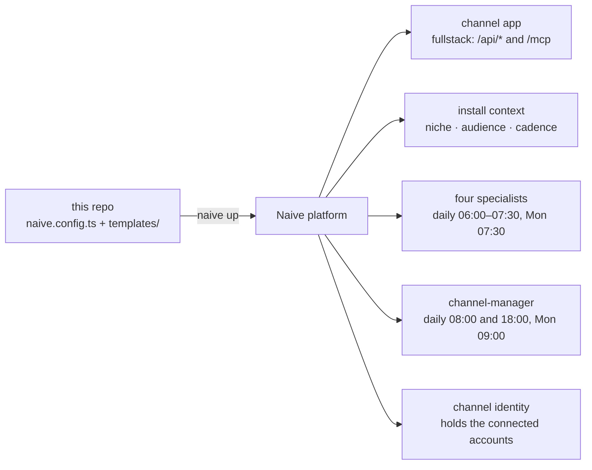

# 🎬 Media Blueprint

**An autonomous short-form video channel in one repository — clone it, run `naive up`, and the
Naive platform provisions the dashboard, the crew and the crons into your own organization.**

[](LICENSE)
[](https://www.npmjs.com/package/@usenaive-sdk/blueprints)
[](https://www.npmjs.com/package/@usenaive-sdk/vetta-cli)
[](https://nodejs.org)
[](https://react.dev)

It ships a management dashboard and a small agent team that plans, makes and queues vertical
video, and publishes only what you have approved.

The blueprint is the machine — the dashboard, `/api/*`, `/mcp`, the store, the approval flow
— and it carries **two templates**, which are data:

| Template | The channel it runs | Its crew | What it files |
|---|---|---|---|
| `faceless` | Generates original short-form video in one niche | `channel-manager`, `producer`, `trend-scout`, `scriptwriter`, `analyst` | produced, multi-part |
| `clipping` | Repurposes existing video in one niche | `channel-manager`, `clipper`, `scout`, `caption-editor`, `analyst` | clips |

A template is a crew you choose, not a count of resources: before anything is provisioned the
studio asks **three questions** (what the channel is about, **where it posts** — one network or
several — and how often), every agent reads the answers back through the platform's
`project_context` tool, and each opens a **day-one** session that turns those answers into the
channel's first briefs, scripts, clips, report and plan. See [The crew](#-the-crew).

One repo carries both, so switching is an edit and a `naive up` — never a re-clone and never a
new app. See [Switching template](#-switching-template).

The engine is [`@usenaive-sdk/blueprints`](https://www.npmjs.com/package/@usenaive-sdk/blueprints),
installed from the public npm registry like any other dependency. Nothing here resolves out of
a private workspace: a clone plus `pnpm install` is the whole toolchain.

## 🗺 What `naive up` provisions



- **The dashboard app** (`channel`, fullstack) — this repo's built UI, hosted under your org,
  backed by a thin server that talks to the platform on your behalf.
- **The template's crew of five** — each with a role, a system prompt that opens by reading the
  install's context, a deny-by-default tool allow-list, the catalogue skills it works from, a
  daily budget, its own crons and a day-one intake session. The roster is in
  [The crew](#-the-crew).
- **Nine starter style templates** (reference image + prompt) covering the current
  high-performing short-form aesthetics — the blueprint's shipped catalogue, present from the
  first turn.
- **The channel's crons** — the seven fires below, so the channel works whether or not anyone
  opens the dashboard.
- **The channel identity** (`channel`) — the persona every agent and every schedule acts as,
  and the reason a connected account is reachable from a turn at all.

A freshly provisioned channel has **no posts**, and every screen shows its empty state until
you or an agent files something. That is the truth about a new deployment: the dashboard never
ships rows that pretend to be work someone did — the first rows are the ones the day-one
sessions file from your three answers.

## 🚀 Get started

You need Node 22 or newer (Vite's floor is `^20.19 || >=22.12`, and `pnpm serve` runs the
server through Node's own TypeScript stripping), [pnpm](https://pnpm.io), and a platform API
key.

```sh
npm install -g @usenaive-sdk/vetta-cli          # installs the `naive` command
git clone https://github.com/usenaive/media-blueprint.git my-channel
cd my-channel
pnpm install

export NAIVE_API_KEY=sk_...                     # your platform API key
naive claim                                     # bind this clone to your organization
pnpm build                                      # UI + dist/api/app.js + dist/vercel.json
naive up                                        # provision everything in naive.config.ts
```

`naive up` reads [`naive.config.ts`](naive.config.ts) and reconciles your organization against
it, reporting each resource as `created | updated | unchanged | deleted | refused`. It is
idempotent — every resource is keyed by its name, so re-running it is always safe — and it
ships the dashboard only when `dist/` actually changed, which is why `pnpm build` comes first.

`NAIVE_API_KEY` is declared on the app as `{ from_env }`, so it is read from your shell at
apply time and never written into this repository. An unset variable refuses the apply by name,
naming the variable and never a value.

| Script | What it does |
|---|---|
| `pnpm install` | installs the toolchain, including the blueprint engine and the `naive` CLI |
| `pnpm build` | builds the UI to `dist/`, then `dist/api/app.js` and `dist/vercel.json` |
| `pnpm test` | the whole vitest suite — routes, MCP, templates, screens, config |
| `pnpm typecheck` | `tsc --noEmit` |
| `pnpm dev` | the hot-reloading UI, proxying `/api` and `/mcp` to `:8788` |
| `pnpm serve` | the dashboard server on `:8788`, over a JSON file store |

### 🔐 Getting into the deployed dashboard

Every `/api/*` route on the deployment — the post queue, "Post now", the agent roster, opening
a session, and deciding a held tool call — is behind the app's `DASHBOARD_TOKEN`. You never
have to invent that value and you never see it: `naive.config.ts` declares it
`{ generate: true }`, the platform makes one on the apply that creates the app, and no route
anywhere returns it.

There are two ways in, and both end in the same place:

- **From the studio.** Open the dashboard from the studio that installed it. That mints a
  short-lived entry ticket, the browser posts it to `POST /api/enter`, and the server trades it
  for an `HttpOnly` session cookie the browser then attaches to every call by itself — the
  credential never passes through the DOM, a URL or storage.
- **With your dashboard password.** `naive.config.ts` also declares `DASHBOARD_PASSWORD`
  `{ generate: true }`: the platform generates a password-shaped value and shows it to you in the
  studio, on the app's **Access** panel (where it can also be rotated). Type it into the gate's
  form and `POST /api/enter` compares it in constant time and sets the very same cookie. A
  deployment with no password set refuses every password.

A browser that reaches the URL without a session sees **one gate screen** and nothing of the app:
the SPA asks `GET /api/session` first (`{ authenticated, studio_url, password_enabled }`, never a
secret) and fetches nothing else until that says it is signed in. On the first arrival in a tab it
sends the browser to the studio's `/open` for this app automatically, once; a tab that comes back
still signed out is shown the **Open with Naive Studio** link and, when a password exists, the
password form. A refused password returns to `/?entry=denied` — the reason travels in the address
and nowhere else, and the form is offered again. A deployment that somehow has no token answers
`503 not configured` to every API route rather than serving your channel to anyone who finds the
URL.

The dashboard also works inside the studio's own `<iframe>`. Framed, the gate never redirects
anywhere on its own — it shows the form at once, and its **Open in the Studio** link opens the
top window. For the frame to be signed in at all, the deployed cookie is `Secure; SameSite=None;
Partitioned` (CHIPS): the browser keys it by the top-level site, so the framed dashboard and a
tab of its own each sign in once and neither can read the other's. Because such a cookie travels
on cross-site requests, a cookie-authenticated **write** (`POST`/`PUT`/`PATCH`/`DELETE`) to a
gated route is honoured only from the dashboard's own origin — `Sec-Fetch-Site: same-origin` or
`none`, or failing that an `Origin` naming this host — and answers `403 cross-site request
refused` otherwise. Reads, bearer-authenticated calls and `/api/enter` itself (the studio's ticket
form is cross-site by design) are not subject to that check. `pnpm serve` on the laptop keeps a
plain `SameSite=Lax` cookie: `Partitioned` requires `Secure`, and the loopback is `http`.

A browser that signed in before the cookie was partitioned still holds the old `SameSite=Lax`
cookie under the same name and sends both. Every `dashboard_session` value on a request is
checked, so the old one cannot shadow a live session; when none matches, the `401` carries a
`Set-Cookie` that expires the old unpartitioned cookie, and a fresh sign-in off the laptop sends
that same expiring header alongside the new cookie.

`/mcp` is untouched by all of this: the organization's agents authenticate there with their own
credentials.

## 👥 The crew

Every agent's `system` opens with the same paragraph — *read `project_context` before anything
else; the answers there are the client's, not yours to invent* — and closes with the approval
gate. Between them is the seat's own brief, 150–400 words. Every agent also holds the
dashboard's `channel.*` tools, `social.accounts`, `social.post` at `ask`, and the two doors to
you (`ask_operator`, `request_tools`, both `ask`); the **Tools** column lists what is granted on
top of that. Every seat carries the same ceilings — **$20 a task and $60 a day, per agent** —
sized so one render of the length the producer is briefed for fits inside a single task
(`ONE_RENDER_MICRO_USD` in [`templates/template.ts`](templates/template.ts)); each timer and each
day one below carries its own budget inside them. Money is integer micro-USD in the declarations;
it is printed in dollars here.

### `faceless`

| Agent | Role | Tools | Skills | Timers (channel time) | Day one |
|---|---|---|---|---|---|
| `channel-manager` *(required)* | Channel lead | `web_search`, `web_fetch`, `send_to_agent`, `list_agents` | `naive/caption-writing` | Mon 09:00 plan ($10) · daily 08:00 queue sweep ($10) · daily 18:00 comments ($10) | Writes the channel plan from the cadence answer — slots per week, days, kinds, accounts — and files it as a brief ($20) |
| `producer` | Video production | `generate_video` (models pinned), `generate_image` | `naive/short-video-hooks` | daily 07:00 render ($10) | Picks the style templates for the niche and renders the first scripted brief ($8) |
| `trend-scout` | Trends & briefs | `web_search`, `web_fetch` | `naive/seo-content-brief`, `naive/short-video-hooks` | Mon & Thu 06:00 briefs ($10) | Researches the niche and files the channel's **first five briefs** ($20) |
| `scriptwriter` | Hooks & scripts | `web_search`, `web_fetch` | `naive/short-video-hooks`, `naive/caption-writing` | daily 06:30 scripts ($10) | Drafts three hooks per brief, picks one, writes the script and caption ($20) |
| `analyst` | Performance | — | — | Mon 07:30 report ($10) | Sets up the weekly report skeleton for this niche and cadence ($20) |

### `clipping`

| Agent | Role | Tools | Skills | Timers (channel time) | Day one |
|---|---|---|---|---|---|
| `channel-manager` *(required)* | Channel lead | `web_search`, `web_fetch`, `send_to_agent`, `list_agents` | `naive/caption-writing` | Mon 09:00 plan ($10) · daily 08:00 queue sweep ($10) · daily 18:00 comments ($10) | Writes the channel plan from the cadence answer and files it as a brief ($20) |
| `clipper` | Clip production | `clip_video` | `naive/clip-selection` | daily 07:00 cuts ($10) | Cuts the first two clips from the scout's briefs; cuts nothing from a source the context does not name ($8) |
| `scout` | Source watch | `web_search`, `web_fetch` | `naive/clip-selection` | daily 06:00 moments ($10) | Goes through the named sources and files the **first five moments** worth cutting ($20) |
| `caption-editor` | Captions & titles | `web_search` | `naive/caption-writing`, `naive/short-video-hooks` | daily 07:30 captions ($10) | Titles and captions the morning's clips and files the channel's caption style ($20) |
| `analyst` | Performance | — | — | Mon 07:30 report ($10) | Sets up the weekly report skeleton by source and clip ($20) |

Only the `channel-manager` is `required` — it is the seat the dashboard's Chat talks to. Every
other seat can be left unticked when the template is installed, and its crons and intake are
then never armed. The `channel` app is `required` too: it is the crew's queue and MCP endpoint.

### The three questions

The studio asks these before anything exists, and the engine refuses a template with a fourth — in
its own words, *"a template asks at most 3 before anything is provisioned — a fourth belongs to the
crew's first conversation"*. There is no onboarding screen in the dashboard: one place to ask, one
place the answers live.

| Template | 1 | 2 | 3 |
|---|---|---|---|
| `faceless` | **Niche** — a choice of six, or your own | **Where should this channel post?** — YouTube Shorts, TikTok, Instagram Reels; **pick one or several** | **Posting cadence** — `daily`, `3× a week`, `weekly` |
| `clipping` | **Source channel(s) you hold the rights to** — text | **Where should this channel post?** — YouTube Shorts, TikTok, Instagram Reels; **pick one or several** | **Posting cadence** — `daily`, `3× a week`, `weekly` |

The middle one is the same question on both templates, and it is the one this channel cannot run
without: **it decides the networks every post the crew files is aimed at**. It is a multi-select
(checkboxes in the studio), because the same vertical video usually goes out on more than one
network: every network you tick is a target the crew files for, and a post that names no network
goes to the **first** one you ticked. It used to be a constant in the code — a line an operator was
expected to edit and re-deploy — so every install of this blueprint filed for the same network
whoever installed it and whatever they had connected.

Three is a budget, so asking that one meant not asking another. The slot came from *"tone and
audience"* on `faceless` and *"niche / audience"* on `clipping`; the channel manager now asks for it
with `ask_operator` in its day-one session, which is exactly where the engine's refusal says a
fourth question belongs. Nothing was dropped — it moved from the form to the conversation.

The answers are the install's project context. Each agent reads them through the platform's
read-only `project_context` tool; you edit them in the studio, and the dashboard's Home screen
shows them as they are.

### …and the one thing the questions cannot do for you

**Picking a network is not connecting an account.** The setup answer tells the crew where to file;
publishing needs an account connected to the channel's identity, and that is one click on the
**Accounts** screen (it opens the platform's own hosted connect portal — the dashboard builds no
OAuth flow of its own). Until it is done, the queue fills and nothing in it can go out.

So the dashboard says so, on **Home** and on **Posts**, above everything else:

> This channel posts to YouTube Shorts, and no YouTube Shorts account is connected yet — nothing
> here can publish until you connect one on Accounts.

With several networks ticked the one line covers each of them, saying which are connected and
which are not:

> This channel posts to YouTube Shorts, TikTok and Instagram Reels, and no YouTube Shorts or
> Instagram Reels account is connected yet — nothing here can publish there until you connect them
> on Accounts. Connected: TikTok as @channel.

It reads the networks from your own answer and the accounts from the platform, and it distinguishes
*"no account connected"* from *"we could not check"* — being told to reconnect an account that is
already fine is how a warning gets ignored. Once the right account is connected on every network the
line goes quiet and names the handles.

**The crew keeps filing while nothing is connected, on purpose.** A queue is a review surface, not
a publish action: refusing to file would throw away a render that has already been paid for (~$3.32
each, see [What it costs](#-what-it-costs)), and every day-one session opens minutes after the
install, before anyone has had a chance to connect anything — so refusing would mean an empty first
day and five intake budgets spent on nothing. What is not acceptable is filing *silently*, which is
what the line above fixes. Publishing still refuses honestly at the button, and the channel
manager's first plan opens by saying whether an account is connected.

### Day one

The apply that creates the crew opens one session per agent with its `intake.message`, each
written to consume the answers: the scout files the first five briefs for *your* niche, the
scriptwriter hooks and scripts them, the producer renders the first one, the analyst lays out the
report, and the manager writes the plan from *your* cadence. Day one costs at most the sum of
the intake budgets ($88 on `faceless`, $88 on `clipping`) — each of those is a **one-time ceiling
on that one session**, not a recurring allowance; the recurring cap is the agent's own
`budget.cap_micro_usd` above. Everything day one makes lands in the queue as pending — nothing is
published. The Home screen tracks each intake session until it finishes.

**All five sessions open at the same moment**, so a seat downstream of another reads a queue that
is still being filled. That is the install, not a fault: every day-one message ends with the same
paragraph (`DAY_ONE_ORDER` in [`templates/template.ts`](templates/template.ts)) telling the seat
so, telling it not to wait and not to report the emptiness as a finding, and pointing the chained
work at the crons — which *do* run in order, hours apart, upstream seat first.

### The skills

Four of the platform's `naive/*` catalogue skills are referenced, read at session start with
`read_skill`: `naive/short-video-hooks` (the first three seconds), `naive/clip-selection`
(which moment to cut and where), `naive/caption-writing` (the caption in the channel's voice)
and `naive/seo-content-brief` (a brief the writer can work from). An agent with no skill is not
granted `read_skill`.

## ⏰ The cadence

Both templates provision seven fires, all of them in the channel's own timezone
(`CHANNEL_TIMEZONE` in [`templates/template.ts`](templates/template.ts) — one line, one edit)
and all of them running as the `channel` identity, so a scheduled run reaches the same
connected accounts a chat turn does. Each fire carries its own `budget_micro_usd`, inside the
agent's per-task ceiling.

| When | Who | What it does |
|---|---|---|
| Mon & Thu 06:00 / daily 06:00 | `trend-scout` / `scout` | Files the next briefs for the niche, or the next moments in the named sources |
| Daily 06:30 | `scriptwriter` (`faceless`) | Hooks, scripts and captions every brief that has none |
| Daily 07:00 | `producer` / `clipper` | Makes the next piece — one produced video, or the next batch of clips — and files it as a pending post |
| Daily 07:30 | `caption-editor` (`clipping`) | Titles and captions the morning's cuts |
| Monday 07:30 | `analyst` | Last week's numbers, before the plan |
| Daily 08:00 | `channel-manager` | Sweeps the queue: captions, kinds and scheduled days, so you open the dashboard to rows that are ready to approve |
| Daily 18:00 | `channel-manager` | Reads the comments and drafts replies in the channel's voice |
| Monday 09:00 | `channel-manager` | Plans the week at the cadence you chose, one brief per slot |

Nothing a cron does escapes the queue: the fires file and tidy pending posts, and every publish
and every reply still stops at your approval, exactly as it does when you brief an agent in
Chat.

## 🎨 The style library

Nine starter style templates ship with the blueprint — a name, a prompt with `[bracketed]`
per-brief slots, a trend note, and the reference image `generate_video` and `generate_image`
condition on. `channel.list_style_templates` is how the producer reads them, and Channel
settings is where you see them. They live in
[`seed/style-templates.ts`](seed/style-templates.ts) with their images in
[`src/assets/styles/`](src/assets/styles).

| Marble & ink | Ghibli dusk | Claymation |
|---|---|---|
|  |  |  |
| stoic / motivation staple | top saves on Reels | nostalgia, high shares |

The other six: Photoreal cinematic, Lo-fi loop, Ambient ASMR, Pixar-style 3D, Paper cutout and
Brainrot absurdist.

## 📮 Where a post can go

A post names one of the three networks that take a vertical video — **instagram, tiktok,
youtube** — and nothing else is offered anywhere in the dashboard or in `create_post`. The list
lives in one place, [`seed/posts.ts`](seed/posts.ts).

It is a deliberate subset of what the platform's social API accepts, and it is the honest one for
this blueprint: **every post this crew files is a video.** The producer renders 1080x1920 and the
clipper cuts one; there is no link, thread or article anywhere in this repo. A text network takes
the caption and drops the render, so a "published" post there ships a line of text and leaves the
work behind. The list this replaced admitted six of those and excluded `youtube` and `instagram` —
two of the three that take the work.

**Where *this* channel posts is yours**, answered in setup (see [The three
questions](#the-three-questions)) — **one network or several** — and read back by everything that
stamps a target: the store's default, the `create_post` tool description the crew reads before
filing, and the line on Home and Posts. The answer is read as a list (`platformsFromAnswers`): every
recognised pick in your order, each once, anything unrecognised dropped. With several picked, the
`create_post` description names all of them as this channel's targets and tells the crew to file
one post per network; a post that names no network still goes to one, and it is the **first you
picked** (`platformFromAnswers`). `platform` on the template is now only the fallback for an install
with no usable answer, and it is the question's own first option so the two cannot disagree. An
agent can still name a different network per post, and the channel manager can retarget a row
before you approve it.

All three publish video and refuse text, so an approved row with no video attached is refused here,
by name, rather than at the button — a brief is exactly that row. And a row targeting a network no
longer on the list (a document written before it was narrowed) is refused with *"retarget the post
first"*, which `channel.update_post` can do.

## 🖥 Operating the channel

| Screen | What it does |
|---|---|
| Home | Whether this channel can publish at all (its network and whether an account is connected), the project context (your three answers, from the latest applied install — "not configured" without a platform key), day-one progress per intake session, approvals due, the crew with each agent's next fire, and the queue by status |
| Chat | Talk to the channel manager — brief it, ask for clips or productions, adjust the plan |
| Posts | The post queue: Pending → Ready → Approved → Posted / Rejected, each row playing the video the agent filed; "Post now" publishes the caption and that video immediately, and only from **Approved** |
| Approvals | Every agent that has stopped to ask you something: the held call, the arguments it proposes (media played), and Approve / Reject with an optional reason |
| Analytics | Views and likes, summed from the posts this channel actually published |
| Accounts | Connect and reconnect social accounts through the hosted portal |
| Channel settings | Which template is running, the live agent roster and briefs, and the style template library |

Nothing goes out without your approval. Agents file posts as *pending* and cannot move them:
the dashboard's MCP server has no approve, reject or publish tool. The platform's own
`social.post` tool *is* granted to every agent — publishing an approved post is their job — but
at permission `ask`, so an agent never runs it unattended: the call pauses the session
(`stop_reason: awaiting_approval`, the session itself `idle`) and waits, listed in the
session's pending actions, until you approve or reject it.

**The Approvals screen is where you answer that.** It lists every session of this channel
holding a pending call, names the agent and the tool, renders the arguments the agent proposes
— playing any video or image among them, because a publish you cannot watch is not one you can
honestly approve — and sends your decision, with an optional reason, to the platform. The same
decision is still available from the CLI, which is where it used to be the *only* place:

```sh
naive session get <session-id>                                # pending_actions lists the held call
naive session confirm <session-id> --tool-call <id> --allow   # or --deny --reason "..."
```

So a post reaches an account by exactly two routes: you publish it yourself from the Posts
screen, or you approve an agent's held `social.post` call.

**An agent can also ask you for something.** Every agent holds two doors to you (both at `ask`,
like everything outward), and its system prompt tells it that the tools offered in a turn are the
complete list of what it can do. When a fire needs a *tool or model* it was not given — no
`generate_video` this turn, no video model pinned, no `clip_video` — it calls `request_tools`,
naming the exact tool, permission and (for video) the model in `config.models`, instead of
narrating a video it never rendered. That is an ordinary tool card on Approvals: approving it
mints a new version of the agent and re-pins the running session, so the tool is offered when the
session resumes and the piece gets made; refusing it ends the request. The next `naive up` writes
the template's toolset back, so a model you want kept belongs in `VIDEO_MODELS` too. When a fire
needs a *fact* only you have — which account, which source video — it calls `ask_operator`: the
session parks at `awaiting_answer`, the question lands on the same screen as a card with fields,
and your answer goes back through `POST /v1/sessions/:id/answers`. Neither door connects an
account: a platform's tools reach a turn only once you have connected it to the `channel` identity.

## 🛠 Building on top of it

This is why the repository is open. The machine is the code in `src/` and `server/`; everything
a channel actually *is* — its crew, their briefs, what they may call, what they file, when they
fire and what the screens call things — is data in [`templates/`](templates), and changing it is
an edit plus a re-apply.

| To change… | Edit | Then |
|---|---|---|
| which template runs | `ACTIVE` in [`templates/index.ts`](templates/index.ts) | `pnpm build && naive up` |
| an agent's brief or its platform tools | the `agent({ … })` call in [`templates/faceless.ts`](templates/faceless.ts) or [`templates/clipping.ts`](templates/clipping.ts) | `naive up` |
| add an agent to the crew | the `agents` array of that template, built with the shared `agent()` helper | `naive up` |
| the model, budget or approval gate every agent shares | [`templates/template.ts`](templates/template.ts) | `naive up` |
| when a cron fires, or what it is told to do | `CHANNEL_MANAGER_SCHEDULES` and the specialist's `schedule({ … })` | `naive up` |
| the timezone all of them fire in | `CHANNEL_TIMEZONE` — one line | `naive up` |
| the post kinds, the three setup questions, the words the queue prints | `kinds`, `questions` and `words` on the template | `pnpm build && naive up` |
| where the channel posts | **you answer it in the studio** — no edit, no deploy | nothing |
| a seat's role, skills or day-one intake | `role`, `skills`, `intake` in its `agent({ … })` call | `naive up` |
| the style library | [`seed/style-templates.ts`](seed/style-templates.ts) | `pnpm build && naive up` |
| the dashboard's screens | [`src/screens/`](src/screens) | `pnpm build && naive up` |
| a new MCP tool for agents to call | [`server/mcp.ts`](server/mcp.ts) and [`server/routes.ts`](server/routes.ts) | `pnpm build && naive up` |

Three rules worth knowing before your first edit:

- **An agent needs a persona.** The `agent()` helper names `CHANNEL_IDENTITY` for you, and
  `schedule()` does the same for every fire. Without it a turn's connection tools resolve to
  nothing, silently, and a cron runs as nobody.
- **The toolset denies by name and asks by default.** Every built-in an agent was not granted
  is written `deny` — the sandbox tools included — and the *default* is `ask`, which is what
  reaches the connection tools no config can enumerate ahead of time. A connection tool is
  therefore always offered and never runs unattended.
- **Never grant `social.post` at `allow`.** That is a publish path straight around the queue
  the dashboard and the system prompts promise. `naive.config.test.ts` and
  `templates/templates.test.ts` exist to stop it happening by accident.

Adding a template is the same shape: a module beside `faceless.ts` and `clipping.ts` exporting
a `MediaTemplate`, its name in the `TemplateName` union, its demo rows in `seed/posts.ts`, and
its entry in `TEMPLATES`. The template tests will tell you what you missed.

## 🔌 Agents and the dashboard

The dashboard is also an MCP server (`POST /mcp`, [`server/mcp.ts`](server/mcp.ts)), and
`naive.config.ts` declares it (`mcp: "/mcp"` on the `channel` app). On every turn, each agent in
the project is offered the dashboard's tools as `channel.<tool>` — no per-agent wiring: the
platform mints the bearer token, injects it into the app as the `VETTA_MCP_TOKEN` secret, and
sends it with every call. Without that token the endpoint answers `401`.

| Tool | What it does |
|---|---|
| `list_posts {status?}`, `get_post {id}` | Inspect the queue |
| `create_post {caption, media_url?, platform?, agent?, account?, source?, status?}` | File a finished piece as *pending* (or *ready*), signed: who filed it, which account it is for, what it was made from |
| `update_post {id, title?, caption?, media_url?, platform?}` | Fix or retarget a pending or ready post; approved and posted ones are yours |
| `list_style_templates`, `list_accounts` | The style library, the connected accounts |

The setup answers are not a tool of this server: the platform offers every agent of the crew its
own read-only `project_context`, so there is one copy of them.

This server publishes nothing: there is no approve, reject or post tool in it, and every tool
description says so. Each `channel.*` tool is allowed by name.

**Connected accounts.** Every agent acts as the `channel` persona, which is what makes the
accounts you connect reachable from a turn: the platform resolves a session's connection tools
along `session → agent → identity → connected accounts`. Those tools register as
`<connector>.<operation>`, and which operations exist depends on the account you connected, so
no config here can name them — which is why the toolsets grant every tool they *can* name
(`allow`, or `deny` for a built-in this crew has no use for, sandbox included) and leave the
default at `ask`. A connection tool is therefore always offered and never runs unattended: it
stops on the Approvals screen with its arguments in front of you, exactly like `social.post`.

The one tool that can reach an account is the platform's own `social.post`, which is not part of
this server. The shared toolset in [`templates/template.ts`](templates/template.ts) grants it to
every agent at permission `ask`, so a call to it never runs unattended — it holds the session at
`awaiting_approval` for your decision (above). The permission is decided there, by the
blueprint, and not by whichever template happens to list the tool.

## 🔁 Switching template

A template is data ([`templates/`](templates)): the crew and its prompts, the tool allow-lists,
the post kinds it files, the three questions the studio asks and the words the queue prints. Nothing
about the machine changes with it — same screens, same routes, same `/mcp`, same app.

```ts
// templates/index.ts
export const ACTIVE: MediaTemplate = TEMPLATES.clipping;   // was TEMPLATES.faceless
```

Then `pnpm build && naive up`. The switch **widens and never narrows**:

- agents the new template declares are **created**;
- an agent only the old template declared is **reported and left running** — `naive.config.ts`
  hands `naive up` both templates, so the other crew is kept, and nothing is deleted by dropping
  a declaration. Retire one deliberately by adding its name to `removed`;
- your own rows are untouched: the posts, the accounts, the install's answers, the app, its URL,
  its database and its MCP token.

The dashboard's Channel settings screen names the template that is running.

**"Left running" means still firing, and still billing.** `naive up` owns an agent's `schedules`
only through the template that declares it, and a kept agent is declared by neither — `up` reports
it `unchanged` and touches nothing on it, its deployments included. So the crew you switched away
from keeps its timers: every morning, on the channel's clock, as the `channel` identity, each fire
opening a real billable session against its own budget and filing into the same queue as the new
crew. Switching `clipping` → `faceless` leaves the clipper (daily 07:00), the scout (daily 06:00)
and the caption-editor (daily 07:30) armed — up to **$30 a day** of ceiling for a crew you
replaced. `faceless` → `clipping` leaves the producer (daily 07:00) and the scriptwriter (daily
06:30), plus the trend-scout on Mondays and Thursdays — up to **$20 a day and $20 a week**. The
`channel-manager` and the `analyst` are declared by both templates, so they are never kept: they
are patched into the new crew.

Nothing in this repository can disarm them. Only the chosen template's agents are reconciled;
`kept` carries names and no schedules; and the platform's one lever is `removed`, which deletes
the agent outright rather than parking it. **So decide about the old crew in the same sitting as
the switch:** add each stranded name to `removed` in `naive.config.ts` and `naive up` again — which
deletes those agents and their crons — or keep them on purpose, knowing what they cost. A third
option (a kept agent's schedules disabled rather than left armed, so a switch stops paying for the
crew it replaced without destroying its history) would be a change to the platform's blueprint
engine, not to this repo.

**Editing a cron has one sharp edge.** Schedules are the only place in `naive up` where dropping
a declaration deletes: an agent's `schedules` are owned as a complete set and matched to live
rows **by exact cron string**, so `"0 8 * * 1"` and `"0 08 * * 1"` are a delete plus a create
rather than a patch. Change a fire's time deliberately; never re-spell one that is not changing.
(An agent with no `schedules` key at all owns nothing and deletes nothing — it is a *partial*
set that is destructive.)

## 💻 Running it locally

- **Demo mode** — `pnpm serve` in one shell and `pnpm dev` in another. The dev server proxies
  `/api` and `/mcp` to `:8788`, so the screens read the seeded **file** store over the real
  routes — seeded with the running template's own demo queue. No sample row is compiled into the
  bundle; `src/no-seed.test.ts` enforces that, which is why the demo rows live in
  [`seed/posts.ts`](seed/posts.ts) and not in `templates/` (the screens import a template).
- **Configured mode** — `pnpm build`, set `NAIVE_API_KEY` (and optionally `NAIVE_API_URL`,
  `NAIVE_IDENTITY_ID` for the channel persona's social routes), then `pnpm serve`. The server
  serves the built UI and fronts the platform behind `/api/*`; the key lives only in that server
  process and never reaches the browser. A screen whose backing route or key is absent says so —
  503 `not configured — set NAIVE_API_KEY` reaches the header slot rather than being swallowed.
  Set `VETTA_MCP_TOKEN` to open `/mcp` locally (the platform sets it in the deployed app);
  without it every MCP request is refused. `/api/*` skips the `DASHBOARD_TOKEN` gate **only** for
  a request that arrives on the loopback interface — your own browser against `pnpm serve`, which
  `GET /api/session` reports as signed in, so the gate screen never shows locally. Anything
  reaching this server over a real network (bound to `0.0.0.0`, a tunnel, a LAN peer) is gated
  exactly as the deployment is; set `DASHBOARD_TOKEN` and, if you want the password form there,
  `DASHBOARD_PASSWORD` (plus `NAIVE_STUDIO_URL` and `NAIVE_APP_ID` for the studio link). None of
  the four is needed for local development.

One route table serves both: [`server/routes.ts`](server/routes.ts) holds every path, `/mcp`
included, and `server/index.ts` (node `http`) and `server/api-entry.ts` (the deployed function)
are thin adapters over it. Locally the store is a JSON file under `data/`, seeded on first run
from `seed/`; on the deployment it is one document in the app database the platform provisions,
created **empty**. The browser and the agents therefore read and write the same rows: a post
filed over MCP is on the Posts screen after a reload.

`pnpm build` emits `dist/api/app.js` — one function for the whole surface — plus
`dist/vercel.json`, whose rewrites send `/mcp` and `/api/*` to it and fall back to `index.html`
for every screen URL.

## 📦 The `naive.config.ts` shape

```ts
import { defineProject } from "@usenaive-sdk/blueprints";
import { CLIPPING_SEEDS, FACELESS_SEEDS } from "./seed/posts.ts";
import { ACTIVE, CHANNEL_IDENTITY, TEMPLATES } from "./templates/index.ts";

export default defineProject({
  name: "media",
  blueprint: "media",
  template: ACTIVE.name,                 // chosen in templates/index.ts
  questions: ACTIVE.questions,           // the three the studio asks: subject, network, cadence
  templates: [                           // every template this repo carries
    { ...TEMPLATES.faceless, seed: { posts: FACELESS_SEEDS } },
    { ...TEMPLATES.clipping, seed: { posts: CLIPPING_SEEDS } },
  ],
  identities: [{ name: CHANNEL_IDENTITY, description: "The channel itself — …" }],
  apps: [
    {
      name: "channel",
      type: "fullstack",
      required: true,                    // the crew's queue and MCP endpoint
      deploy_dir: "dist",
      mcp: "/mcp",
      env: {
        NAIVE_API_KEY: { from_env: "NAIVE_API_KEY" },
        DASHBOARD_TOKEN: { generate: true },     // the operator bearer; never shown
        DASHBOARD_PASSWORD: { generate: true },  // the operator's dashboard password; shown in the studio
      },
    },
  ],
});
```

The app is named `channel`, not `dashboard`: app names are unique per organization, so two
blueprints sharing a generic name would mean the second `naive up` adopts and overwrites the
first's app — its deployment, its database and its MCP token — and reports it as a routine
update.

The deployment is declared, not clicked together. To change agents, budgets, tool policies, or
the app itself, edit the config (and/or the UI code), rebuild, and run `naive up` again. To
delete a resource, move its name into the config's `removed` block (e.g.
`removed: { agents: ["producer"] }`); nothing is deleted just by dropping a declaration — which
is exactly what makes switching template safe.

The config can declare more than this template uses:

| Key | What it provisions |
|---|---|
| `apps[]` | `name`, `type`, `description`, `deploy_dir`, `mcp` (the path of the app's own MCP endpoint; fullstack only), and `env` — literals, `{ from_env }` or `{ generate: true }`, written as the app's secrets |
| `questions[]` | the setup questions (`text` or `choice`); at most three when a `template` is set |
| `agents[]` | `role`, `required`, `model`, `budget`, `system`, `tools`, `skills` (`naive/<slug>` for the catalogue), `intake`, `mcp_servers`, `allowed_apps`, `identity`, `schedules` |
| `agents[].intake` | `message` and `budget_micro_usd` of the session the apply opens on day one |
| `agents[].schedules[]` | cron deployments, owned as a complete set per agent and matched by `cron` |
| `skills[]` | markdown files pushed by slug, versioned by content |
| `identities[]` | personas agents and schedules act as |
| `vaults[]` | credential vaults; values are `{ from_env }` only and reconciled by presence |
| `removed` | `apps`, `agents`, `skills`, `identities`, `vaults` to delete by name |

See the `naive` CLI reference in the platform docs for the reconciliation rules behind each key.

## 🤝 Contributing

Issues and pull requests are welcome — this repository is meant to be forked, cut about and
argued with.

- Fork, branch, and keep the change to one thing.
- `pnpm install && pnpm typecheck && pnpm test && pnpm build` must be green before you open a
  PR. The suite is fast and it is the review's floor, not its ceiling.
- Prefer adding a **template** over widening the machine: if your change is a channel's opinion
  rather than a channel's plumbing, it belongs in `templates/`.
- Nothing may weaken the approval gate. `naive.config.test.ts`, `templates/templates.test.ts`
  and `src/no-seed.test.ts` exist to catch exactly that — a publish path around the queue, or a
  demo row shipped as somebody's real data.
- Write the *why* in the commit message. The prose in this repository is part of the product.

## 📄 License

[MIT](LICENSE) © Naive. Clone it, change it, run your channel on it.
